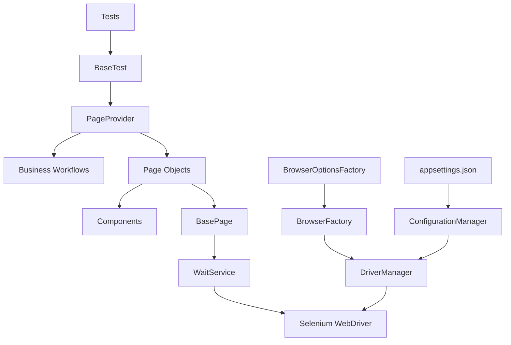

# SauceDemo Test Automation Framework

A UI test automation framework for the **SauceDemo** application built with **C#**, **.NET 10**, **Selenium WebDriver**, and **NUnit**.

The project was developed as the final assignment for the **Automated Testing in .NET with Selenium WebDriver** course.

---

## Tested Application

https://www.saucedemo.com

---

## Technology Stack

- C#
- .NET 10
- Selenium WebDriver
- NUnit
- FluentAssertions
- Microsoft.Extensions.Configuration

---

## Supported Browsers

- Mozilla Firefox
- Microsoft Edge
- Google Chrome

The browser is configured in **appsettings.json**.

Example:

```json
{
  "TestSettings": {
    "Browser": "Firefox"
  }
}
```

---

## Framework Architecture



---

## Project Structure

```text
SauceDemo.Tests
│
├── Business
│   ├── Models
│   ├── TestData
│   └── Workflows
│
├── Components
│
├── Configuration
│
├── Core
│   ├── Browsers
│   ├── Driver
│   ├── Factories
│   └── Waits
│
├── Pages
│
├── Tests
│
└── Utilities
```

---

## Design Principles

The framework follows a layered architecture and applies the following design principles:

- Page Object Model (POM)
- Workflow layer for business actions
- Factory pattern
- Configuration-driven execution
- Explicit waits only (Implicit Wait = 0)
- Constructor Dependency Injection
- Separation of concerns

---

## Implemented Test Scenarios

### UC-1 — Login Validation

Verify that an error message is displayed when attempting to log in without entering a password.

### UC-2 — Successful Login

Verify that a standard user can successfully log in and that the Inventory page is displayed with all required UI elements.

### UC-3 — Add Product to Cart

Verify that a product can be added to the shopping cart.

---

## Configuration

Framework settings are stored in:

```text
appsettings.json
```

Available settings:

| Setting | Description |
|----------|-------------|
| BaseUrl | Application URL |
| Browser | Firefox / Edge / Chrome |
| Headless | Run browser in headless mode |
| TimeoutSeconds | Explicit wait timeout |

---

## Running Tests

Run all tests from the command line:

```bash
dotnet test
```

Or execute tests using **Visual Studio Test Explorer**.

---

## Design Decisions

The framework intentionally uses:

- Explicit waits
- Constructor Dependency Injection
- Page Object Model
- Business Workflows
- Browser Factory
- Centralized configuration
- Lightweight Page Provider

The project intentionally avoids unnecessary complexity such as IoC containers, WebDriverManager, and advanced reporting frameworks to keep the solution simple, maintainable, and appropriate for a junior-level automation framework while remaining extensible.

---

## Future Improvements

Possible future enhancements include:

- Parallel cross-browser execution
- CI/CD integration (GitHub Actions or Azure DevOps)
- Test reporting (Allure or ExtentReports)
- Structured logging
- Automatic screenshots on test failures
- External data-driven testing
- Browser execution via command-line arguments
- Docker support

---

## Author

**Andriy**